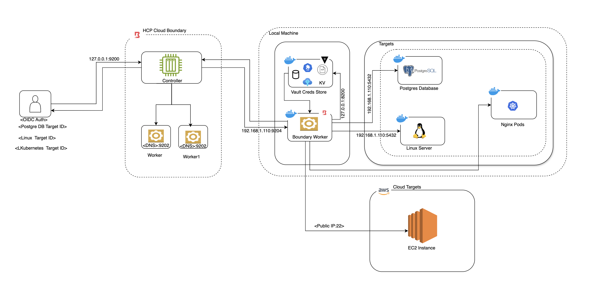

# Introduction
HashiCorp Boundary is an identity-based access management tool that securely connects users to critical systems without exposing credentials or networks. It simplifies access to infrastructure and applications using just-in-time credentials, role-based policies, and session logging, enhancing security while reducing operational complexity in modern cloud and hybrid environments.

# What do we conver in this Lab
* Prerequisits
* Setup Hashicorp Boundary
* Boundary usecases
* Docker and kubernetes installation 

# Prerequsites
* HCP Boundary Cloud account with running boundary instances
* Docker & Docker-compose installed in your docker
* Install Kind in your local for Kubernetes cluster deployment
* Deploy the Openssl on docker container
* Deploy the Vault on docker container
* Deploy the kubernetes on docker container

# Setup Hashicorp HCP Boundary Cloud Instance
* HCP Cloud url: https://portal.cloud.hashicorp.com/sign-in
* After successful login you will able to see the dashboard. Choose Boundary and deploy the boundary
* Once boundary deployed successfuly you will be able to see the cluster url to login into your boundary account with your creds.

# Boundary Usecases
* USECASE1:
  1. Deploy the Linux server on the docker container
  2. Configure the hashicorp vault and store the username and private key in Vault kv path
  3. Configure the boundary target
  4. Configure the Credential store to get the creds from the Hahsicorp Vault
  5. login to the boundary desktop client/ cli to access the targets
  6. Connect to the endpoint.

# Install the Docker, Docker-compose and kind
* Install Kind on your machine https://kind.sigs.k8s.io/docs/user/quick-start/
* Install Docker 




# Steps Build Boundary Docker Worker (local machine)
Create a root folder for your HCP Boundary Docker, inside that folder create the following docker-compose.yml and volume file structure.

## Step 1
login into HCP Boundary Cloud Account

1. log into the Admin Portal and click on WORKERS, grab one of the IP address from one of the 2 workers deployed
2. Create the configuration file and input that IP Address/FQDN:9202 

```
cat > config/boundary/config/config.hcl << EOF
disable_mlock = true

listener "tcp" {
  address = "0.0.0.0:9203"
  purpose = "proxy"
}

worker {
  initial_upstreams = ["IP Address/FQDN:9202"]
  auth_storage_path = "/boundary-hcp-worker/file/worker2"
  #recording_storage_path = "/boundary-hcp-worker/recording/"
  tags {
    type = ["dockerlab"]
  }
}

EOF
```

## Step 2: Deploy the docker environment. 

1. Start your environment.
 
```
docker-compose up -d
```

2. When the docker is online, grab the worker token.


3. Next, in your CLI export the token

```
export WORKER_TOKEN=<insert>
```

4. Log into boundary using the cli, set an export for boundary_addr to your own HCP.

```
export BOUNDARY_ADDR=<insert>
```

5. Authenticate to boundary with your admin username and password

```
boundary authenticate 
```

6. Execute the following command to create a boundary worker in HCP Boundary

```
boundary workers create worker-led -worker-generated-auth-token=$WORKER_TOKEN
```

Now if you log into your HCP Boundary Worker section you will see ur worker get created.


## Step 3: Deploy the Setup Script
Since we are deploying this locally on your machine or pc we will need your IP address. So for now edit the deploy.sh and add your IP address of your machine. 

1. Edit the deploy.sh export HOSTIP=<insert your pc ip>
2. 

``` 
chmod +x ./start.sh 
```
3. Execute the command to do the configuraiton.

```
./start.sh
```

## Step 4: Run the below scripts to deploy the users and user groups and policies.
* The script will deploy the One user in global scope and three users in Org scope and it will assign the role and projects to each users.
* Execute the command to configure the users and user groups and roles.

```
./u_deploy.sh
```

## Step 5: Test it out
You should already be authenticate, but you can authenticate again.  
```
export BOUNDARY_ADDR=<insert>
boundary authenticate 
```

Execute SSH injection command

```
boundary connect ssh -target-name="Linux" -target-scope-name="Docker Servers"
```


Execute Kube connection 

```
boundary connect kube -target-name="K8s" -target-scope-name="Docker K8s" -- get pods -A
```


Postgres Brokering 

```
boundary connect postgres -target-name="Postgres DB" -target-scope-name="Docker DB" --dbname database
```

## How to destroy your environment
To clean up your environment run the following script
1. ``` chmod +x ./destroy.sh ```
2. Execute ``` ./destory.sh  ```
3. ``` chmod +x ./destroy.sh ```
4. Execute ``` ./u-destroy ```

